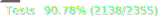

<h1 align="center">
  
  <br>
  StateViz
</h1>

<h4 align="center">
  Analyze application state across multiple frontend libraries
</h4>

<p align="center">
  
</p>


- [Why?](#why)
- [Features](#features)
  - [Supported libraries](#supported-libraries)
- [Installation](#installation)
  - [From Source](#from-source)
- [Tests](#tests)
  - [Unit and Integration Tests](#unit-and-integration-tests)
  - [Example Applications](#example-applications)
- [Future Work](#future-work)
- [License](#license)
- [Attributions](#attributions)


## Why?
The motivation behind creating this extension stemmed from my experience using various frontend frameworks. I found it frustrating to juggle multiple extensions, each in a separate tab, with its own layout and UI. This was especially true for a polyglot project (React/Svelte) I was working on.

I wanted a single extension that could provide a unified view of the application state, regardless of the frontend library used. Something that could be easily extended to support new libraries and provide a consistent experience across all of them.

So, I decided to develop a proof-of-concept. As things progressed, it became the basis for my [CS Master's thesis](#thesis) and StateViz was born.

## Features
- **Multi-Library Support**: Inspect web applications built with different libraries, including those using multiple libraries simultaneously.
- **App Structure Visualization**: Visualize the structure of your application, including components, DOM elements, and library-specific elements like Svelte blocks.
- **Real-Time Data Inspection**: Inspect component data in real-time, including props, state, and library-specific details like contexts and hooks for React.
- **Element Filters**: Use filters to display only the elements you are interested in.
- **DOM Element Highlighting**: Efficiently highlight DOM elements corresponding to selected tree nodes.
- **Light and Dark Mode**: Choose between light and dark themes for a comfortable user experience in any lighting condition.

### Supported libraries


... and more to come!

## Installation

<!-- ### Chrome Web Store
The extension is available on the Chrome Web Store. You can install it from [here](https://chrome.google.com/webstore/detail/stateviz/).
6. Open the developer tools in any tab that runs a supported frontend library application.
7. Click on the StateViz tab in the developer tools to start using the extension. -->

### From Source
1. Clone the repository:
```bash
git clone https://github.com/steciuk/StateViz.git
```
2. Move to the extension directory:
```bash
cd StateViz/extension
```
3. Install dependencies:
```bash
npm install
```
4. Build the extension:
```bash
npm run build
```
5. Load the extension in Chrome.
   - Open Chrome and navigate to `chrome://extensions`.
   - Enable Developer mode.
   - Click on `Load unpacked` and select the `dist` directory inside the `extension` directory.

6. Open the developer tools in any tab that runs a supported frontend library application.
7. Click on the StateViz tab in the developer tools to start using the extension.

## Tests
### Unit and Integration Tests
To run the tests, use the following command in the `extension` directory:

```bash
npm run test
```
### Example Applications
In `test-apps` directory, you will find a collection of example applications designed to help you test and explore the capabilities of the extension.

To run any of the example applications, navigate to the desired directory and:

1. Install dependencies:
```bash
npm install
```
2. Start the development server:
```bash
npm run dev
```
3. Open the application in your browser.
4. Use the extension to inspect the application.

<!-- ## Thesis
The thesis document can be found [here](doc/thesis.pdf).  -->


## Future Work
See the [issues tab](https://github.com/steciuk/StateViz/issues) for planned features and improvements.

## License
This project is licensed under the MIT License - see the [LICENSE](LICENSE) file for details.

## Attributions
Current extension logo made by [Tanvir Islam](https://thenounproject.com/creator/tanvirislam/).

