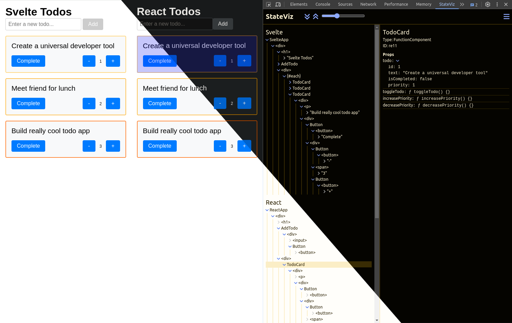
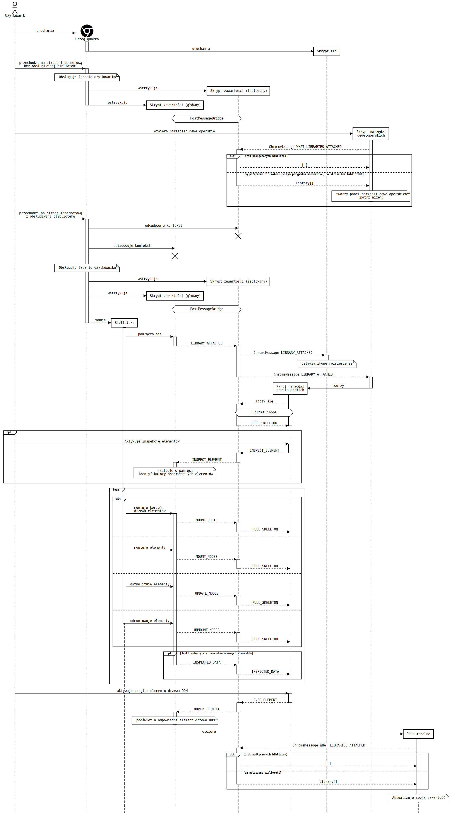

<h1 align="center">
  
  <br>
  StateViz
</h1>

<h4 align="center">
  Analyze application state across multiple frontend libraries
</h4>

<div align="center">
  Supported libraries:
  <div>
     
    
  </div>
  ...and more to come!
</div>

- [Why?](#why)
- [Features](#features)
  - [Supported libraries](#supported-libraries)
- [Requirements](#requirements)
  - [Svelte](#svelte)
  - [React](#react)
- [Installation](#installation)
  - [Chrome Web Store](#chrome-web-store)
  - [From Source](#from-source)
- [Tests](#tests)
  - [Unit and Integration Tests ](#unit-and-integration-tests-)
  - [Example Applications](#example-applications)
- [Future Work](#future-work)
- [License](#license)
- [Attributions](#attributions)
- [Thesis](#thesis)
  - [Thesis Abstract](#thesis-abstract)
  - [Extension Communication UML Diagram](#extension-communication-uml-diagram)


## Why?
The motivation behind creating this extension stemmed from my experience using various frontend frameworks. I found it frustrating to juggle multiple extensions, each in a separate tab, with its own layout and UI. This was especially true for a polyglot project (React/Svelte) I was working on.

I wanted a single extension that could provide a unified view of the application state, regardless of the frontend library used. Something that could be easily extended to support new libraries and provide a consistent experience across all of them.

So, I decided to develop a proof-of-concept. As things progressed, it became the basis for my [CS Master's thesis](#thesis) and StateViz was born.

## Features
- **Multi-Library Support**: Inspect web applications built with different libraries, including those using multiple libraries simultaneously.
- **App Structure Visualization**: Visualize the structure of your application, including components, DOM elements, and library-specific elements like Svelte blocks.
- **Real-Time Data Inspection**: Inspect component data in real-time, including props, state, and library-specific details like contexts and hooks for React.
- **Element Filters**: Use filters to display only the elements you are interested in.
- **DOM Element Highlighting**: Efficiently highlight DOM elements corresponding to selected tree nodes.
- **Light and Dark Mode**: Choose between light and dark themes for a comfortable user experience in any lighting condition.


### Supported libraries
- [React](https://react.dev/)
- [Svelte](https://svelte.dev/)

... and more to come!



## Requirements
### Svelte
- The extension is compatible with Svelte version `4.0.0` and above.
- In order to use this extension to analyze Svelte applications, you need to build the application with the `dev` option set to `true`.

### React
- The extension is compatible with React version `16.0.0` and above.

## Installation
### Chrome Web Store
The extension is available on the Chrome Web Store. 

1. Install it from [here](https://chromewebstore.google.com/detail/stateviz/fckfpalhoncacipdeapifooaljchalin).
1. Open the developer tools in any tab that runs a supported frontend library application.
1. Click on the StateViz tab in the developer tools to start using the extension.

### From Source
1. Clone the repository:
```bash
git clone https://github.com/steciuk/StateViz.git
```
2. Move to the extension directory:
```bash
cd StateViz/extension
```
3. Install dependencies:
```bash
npm install
```
4. Build the extension:
```bash
npm run build
```
5. Load the extension in Chrome.
   - Open Chrome and navigate to `chrome://extensions`.
   - Enable Developer mode.
   - Click on `Load unpacked` and select the `dist` directory inside the `extension` directory.

6. Open the developer tools in any tab that runs a supported frontend library application.
7. Click on the StateViz tab in the developer tools to start using the extension.

## Tests
### Unit and Integration Tests 

To run the tests, use the following command in the `extension` directory:

```bash
npm run test
```
### Example Applications
In `test-apps` directory, you will find a collection of example applications designed to help you test and explore the capabilities of the extension.

To run any of the example applications, navigate to the desired directory and:

1. Install dependencies:
```bash
npm install
```
2. Start the development server:
```bash
npm run dev
```
3. Open the application in your browser.
4. Use the extension to inspect the application.

## Future Work
See the [issues tab](https://github.com/steciuk/StateViz/issues) for planned features and improvements.

## License
This project is licensed under the MIT License - see the [LICENSE](LICENSE) file for details.

## Attributions
Current extension logo made by [Tanvir Islam](https://thenounproject.com/creator/tanvirislam/).

## Thesis
The thesis document can be found [here](doc/thesis.pdf). It provides a detailed overview of the extension, its architecture, and the technologies used to build it. It also includes a comprehensive evaluation of the extension's performance and usability. Unfortunately, the document is only available in Polish, but in the future, I plan to provide an English *GPTranslated* version.

### Thesis Abstract
> This paper delves into the complex realm of integrating developer tools with modern frontend libraries, culminating in the creation of a versatile tool aimed at analyzing structure and data flow between components in web applications.<br><br>
A thorough examination of existing solutions identified essential features for the new tool, leading to its implementation as a browser extension aligned with established requirements.<br><br>
By delving into the inner workings of React and Svelte libraries, representing different approaches to state management in web applications, a universal tool architecture was devised, prioritizing performance, flexibility, and extensibility to accommodate additional libraries.<br><br>
The analysis of React Developer Tools, a prominent browser extension, provided valuable insights into established design practices and communication methodologies. Leveraging these insights, an efficient communication system was implemented, facilitating seamless interaction between the extension's components and web applications.<br><br>
Overcoming unforeseen challenges during the project resulted in improving an open- source unit testing library used for Chrome extensions, as well as the creation and release of a new library enhancing the capabilities of the Vite web application building tool.<br><br>
Thorough testing and comparison with existing extensions confirmed the developed solution's stability, performance, and adaptability while highlighting areas for further development and enhancement.<br><br>
This paper offers a comprehensive overview of designing and implementing a browser extension for developer tools, setting the stage for future research and innovation in supporting the web application development process.<br><br>
Keywords: *React*, *Svelte*, *developer tools*, *universal browser extensions*, *application state analysis*, *Vite*, *React Developer Tools*, *Chrome Extension API*

### Extension Communication UML Diagram
Below you can find a UML diagram from the thesis document, illustrating the communication between the extension components and the inspected web application, as it may be useful for understanding the extension's architecture.




